# Modelo Entidade-Relacionamento — Crescendo Juntos

## Diagrama (Mermaid `erDiagram`)

```mermaid
erDiagram
    USUARIO ||--o{ GESTACAO : "é gestante de"
    GESTACAO ||--o{ BEBE : "contém"
    BEBE ||--o{ MEDICAO_BEBE : "tem medições"
    USUARIO ||--o{ MEDICAO_BEBE : "registra"
    USUARIO ||--o{ PARTICIPACAO : "participa"
    GESTACAO ||--o{ PARTICIPACAO : "reúne"
    PARTICIPACAO ||--o{ PERMISSAO : "define"
    GESTACAO ||--o{ REGISTRO_HUMOR : "registra"
    GESTACAO ||--o{ POSTAGEM : "possui"
    USUARIO ||--o{ POSTAGEM : "escreve"
    POSTAGEM ||--o{ CURTIDA : "recebe"
    USUARIO ||--o{ CURTIDA : "faz"
    POSTAGEM ||--o{ COMENTARIO : "recebe"
    USUARIO ||--o{ COMENTARIO : "escreve"
    GESTACAO ||--o{ EVENTO_CALENDARIO : "agenda"
    BEBE ||--o{ EVENTO_CALENDARIO : "acompanha"
    USUARIO ||--o{ EVENTO_CALENDARIO : "cria"
    UNIDADE_SAUDE ||--o{ EVENTO_CALENDARIO : "sedia"
    RECOMENDACAO ||--o{ EVENTO_CALENDARIO : "é cumprida por"
    EVENTO_CALENDARIO ||--o{ ANEXO_EVENTO : "tem anexos"
    USUARIO ||--o{ ANEXO_EVENTO : "envia"
    MUNICIPIO ||--o{ UNIDADE_SAUDE : "lista postos/serviços"
    MUNICIPIO ||--o{ USUARIO : "localiza"
    REGIAO_FRUTA ||--o{ COMPARACAO_TAMANHO : "varia a fruta por região"
    REGIAO_FRUTA ||--o{ MUNICIPIO : "agrupa para comparação"
    TAMANHO_SEMANA ||--o{ COMPARACAO_TAMANHO : "tem frutas por região"

    %% DICA, COMPARACAO_TAMANHO e RECOMENDACAO são CATÁLOGOS independentes:
    %% NÃO têm relacionamento (nem FK) com GESTACAO/BEBE. Existe uma linha por
    %% semana/faixa/idade — nunca uma por gestação. O cruzamento é feito pela
    %% aplicação contra a idade derivada (ver tabela de mapeamento abaixo).
    %% COMPARACAO_TAMANHO ganhou uma dimensão de REGIAO_FRUTA (a fruta varia por
    %% região) — continua sem FK para GESTACAO/BEBE; só a região é interna ao catálogo.

    USUARIO {
        int id PK
        uuid auth_uid UK "id do usuário no Supabase Auth (auth.uid do JWT) - sem FK: auth vive em outro banco"
        string nome
        string email UK
        date data_nascimento
        int municipio_id FK "nullable - cidade selecionada"
        datetime criado_em
        datetime atualizado_em
    }
    GESTACAO {
        int id PK
        int gestante_id FK
        date dum "opcional, informativo"
        date dpp "canônica, editável pelo usuário"
        string status "enum: gestacao|puerperio|concluida|interrompida"
        datetime criado_em
        datetime atualizado_em
    }
    BEBE {
        int id PK
        int gestacao_id FK
        string nome "nullable"
        string sexo "enum"
        date data_nascimento "nullable"
        datetime criado_em
        datetime atualizado_em
    }
    MEDICAO_BEBE {
        int id PK
        int bebe_id FK
        int registrado_por FK
        date data
        string fase "enum: gestacional|nascimento|pediatrica"
        decimal peso "kg, nullable"
        decimal comprimento "cm, nullable"
        string observacao
        datetime criado_em
    }
    PARTICIPACAO {
        int id PK
        int gestacao_id FK
        int usuario_id FK
        string papel "enum: parceiro|familia"
        string status_convite "enum: pendente|aceito|recusado"
        date data_entrada
        datetime criado_em
        datetime atualizado_em
    }
    PERMISSAO {
        int id PK
        int participacao_id FK
        string aba "enum: feed|chat|gestacao|humor|calendario|bebe"
        string acao "enum: ver|criar|curtir|comentar - ver e o minimo; criar/curtir/comentar so se aplicam a abas interativas (feed)"
        boolean permitido
    }
    REGISTRO_HUMOR {
        int id PK
        int gestacao_id FK
        date data
        string humor "enum"
        string nota
        datetime criado_em
    }
    POSTAGEM {
        int id PK
        int gestacao_id FK
        int autor_id FK
        string conteudo
        string url_midia "nullable"
        datetime data
        datetime criado_em
        datetime atualizado_em
        datetime deleted_at "exclusão lógica"
    }
    CURTIDA {
        int id PK
        int postagem_id FK
        int usuario_id FK
        datetime data
    }
    COMENTARIO {
        int id PK
        int postagem_id FK
        int autor_id FK
        string texto
        datetime data
        datetime deleted_at "exclusão lógica"
    }
    EVENTO_CALENDARIO {
        int id PK
        int gestacao_id FK
        int bebe_id FK "nullable - acompanhamento pós-nascimento"
        int criado_por FK
        string titulo
        string tipo "enum: consulta|exame|vacina|pediatria|outro"
        datetime data_hora
        int unidade_saude_id FK "nullable - no máximo um com endereco_livre"
        string endereco_livre "nullable - no máximo um com unidade_saude_id"
        int recomendacao_id FK "nullable - quando o evento cumpre uma recomendação do catálogo"
        string observacao "nullable - anotações da consulta/exame"
        int lembrete_minutos_antes "nullable - dispara aviso N min antes; null = sem lembrete"
        datetime criado_em
        datetime atualizado_em
    }
    ANEXO_EVENTO {
        int id PK
        int evento_id FK
        int enviado_por FK
        string tipo "enum: laudo|imagem|documento"
        string s3_key "chave do objeto no S3 (bucket privado); URL pré-assinada gerada em runtime"
        string content_type "nullable - MIME, ex.: application/pdf"
        int tamanho_bytes "nullable - tamanho do arquivo"
        string descricao "nullable - legenda do anexo"
        datetime criado_em
        datetime deleted_at "exclusão lógica"
    }
    MUNICIPIO {
        int id PK
        string nome "cidade, ex.: Ilhéus"
        string uf
        string codigo_ibge UK "nullable - código IBGE do município"
        int regiao_fruta_id FK "nullable - região de comparação de tamanho; null = usa 'Nacional'"
    }
    UNIDADE_SAUDE {
        int id PK
        int municipio_id FK
        string nome
        string tipo "enum: ubs|hospital|maternidade|laboratorio|outro (ubs = posto de saúde)"
        string logradouro
        string numero
        string complemento "nullable"
        string bairro
        string cep
        decimal latitude
        decimal longitude
        string google_place_id "nullable - abre o local no Maps"
        string telefone
        boolean ativo "default true - baixa lógica do catálogo"
    }
    DICA {
        int id PK
        string categoria "enum"
        string fase "enum: gestacional|infantil"
        string unidade "enum: semana|mes — semana p/ gestacional, mes p/ infantil"
        int idade_inicio "valor na unidade da fase"
        int idade_fim "valor na unidade da fase"
        string titulo
        string conteudo
    }
    REGIAO_FRUTA {
        int id PK
        string nome "ex.: Nacional, Sul da Bahia, Nordeste"
        boolean ativo "default true - baixa lógica do catálogo"
    }
    TAMANHO_SEMANA {
        int semana PK "1..42 - tamanho/peso de referência do feto; INDEPENDE de região"
        decimal comprimento_cm "nullable"
        decimal peso_g "nullable"
    }
    COMPARACAO_TAMANHO {
        int semana FK "parte da PK composta - referencia TAMANHO_SEMANA"
        int regiao_fruta_id FK "parte da PK composta - aponta para 'Nacional' por padrão"
        string fruta "nome da fruta - varia por região"
        string imagem_url "imagem da fruta no S3 público/CDN (catálogo, não sensível) - varia por (semana, regiao_fruta_id)"
    }
    RECOMENDACAO {
        int id PK
        string tipo "enum: vacina|cuidado|alerta|exame"
        string fase "enum: gestacional|infantil"
        string unidade "enum: semana|mes — semana p/ gestacional, mes p/ infantil"
        int idade_inicio "valor na unidade da fase"
        int idade_fim "valor na unidade da fase"
        string prioridade "enum: normal|importante|prioritaria - default normal"
        string titulo
        string descricao
    }
```



## Atributos derivados (NÃO persistidos)

| Derivado | Cálculo | Origem |
|---|---|---|
| **semana_atual** | `40 − ceil((dpp − hoje) / 7)` | a partir da DPP (fase gestacional) |
| **idade do bebê** | `hoje − data_nascimento` (semanas/meses) | a partir de `BEBE.data_nascimento` |
| **indicador de fase** | sem `data_nascimento` → mostra semana gestacional · com `data_nascimento` → mostra idade do bebê | presença de `data_nascimento` |

> A DPP é o único âncora de idade gestacional. Quando o usuário informa "estou em X semanas hoje",
> a aplicação **recalcula a DPP** (`DPP = hoje + (40 − X)·7`) — não cria coluna nova. A DUM, quando
> conhecida, fica apenas como registro de origem (`DPP ≈ DUM + 280 dias`).
>
> **Após o nascimento** (`BEBE.data_nascimento` preenchida, `GESTACAO.status = puerperio`) a interface
> deixa de exibir a semana gestacional e passa a mostrar a idade do bebê; os acompanhamentos seguem em
> `MEDICAO_BEBE` (pediatria) e `EVENTO_CALENDARIO` (consultas/vacinas vinculadas ao `bebe_id`).

## Vínculo dos catálogos com a idade (DICA · COMPARACAO_TAMANHO · RECOMENDACAO)

Os três são **tabelas de referência (catálogo)** e **não têm FK para** `GESTACAO` ou `BEBE` — o
cruzamento com a gestação/bebê é feito pela aplicação, não por relacionamento. (No diagrama, só
`DICA` aparece de fato **solta**; `COMPARACAO_TAMANHO` e `RECOMENDACAO` têm associações **internas
ao catálogo** — para `TAMANHO_SEMANA`/`REGIAO_FRUTA` e para `EVENTO_CALENDARIO`, respectivamente —
mas nunca para `GESTACAO`/`BEBE`.) Não faria
sentido criar um registro por gestação: existe **uma linha por semana** (COMPARACAO_TAMANHO),
**por faixa de semanas** (DICA) ou **por faixa de idade do feto/criança** (RECOMENDACAO),
compartilhada por todas as gestações. A junção é feita **pela aplicação**, em runtime, contra um
valor **derivado** (não persistido) — e não se cria FK para coluna calculada. O cruzamento é:

| Catálogo | Coluna de junção | Cruzado com | Condição de exibição |
|---|---|---|---|
| **TAMANHO_SEMANA** | `semana` (PK, ponto) | `semana_atual` (derivada da DPP) | `semana = semana_atual` — tamanho/peso do feto, **igual para toda região** |
| **COMPARACAO_TAMANHO** | `semana` + `regiao_fruta_id` | `semana_atual` + região do usuário | `semana = semana_atual AND regiao_fruta_id = :regiao`, com **fallback** para 'Nacional' — só fruta/imagem |
| **DICA** (`fase = gestacional`, `unidade = semana`) | `idade_inicio`..`idade_fim` (faixa) | `semana_atual` (derivada da DPP) | `semana_atual BETWEEN idade_inicio AND idade_fim` |
| **DICA** (`fase = infantil`, `unidade = mes`) | `idade_inicio`..`idade_fim` (faixa) | idade do bebê em meses (derivada de `data_nascimento`) | `idade_meses BETWEEN idade_inicio AND idade_fim` |
| **RECOMENDACAO** (`fase = gestacional`, `unidade = semana`) | `idade_inicio`..`idade_fim` (faixa) | `semana_atual` (derivada da DPP) | `semana_atual BETWEEN idade_inicio AND idade_fim` |
| **RECOMENDACAO** (`fase = infantil`, `unidade = mes`) | `idade_inicio`..`idade_fim` (faixa) | idade do bebê em meses (derivada de `data_nascimento`) | `idade_meses BETWEEN idade_inicio AND idade_fim` |

> **Por que `unidade` em RECOMENDACAO:** as colunas `idade_inicio`/`idade_fim` carregam *semanas* na
> fase gestacional e *meses* na fase infantil. A coluna `unidade` (derivável de `fase`, mas explicitada
> para evitar leitura ambígua) torna a unidade de medida inequívoca para quem consulta a tabela e para
> o `CHECK` de consistência.

## Entidades

| Entidade | Função |
|---|---|
| **USUARIO** | Pessoa cadastrada. Autenticação é externa (Supabase Auth + IDaaS): guarda `auth_uid` (UUID do JWT), nunca senha. Como o Supabase é usado **só para autenticação** e os dados ficam na AWS, não há FK para `auth.users` — o vínculo é o UUID copiado, validado pelo backend NestJS. O papel NÃO fica aqui — é contextual (ver PARTICIPACAO). |
| **GESTACAO** | Núcleo do modelo e container da jornada (gestação → puerpério/pós-parto). Pertence a uma gestante dona (`gestante_id`), com acesso total implícito. DPP editável é o âncora da idade gestacional; `status` registra a fase. |
| **BEBE** | Bebê(s) de uma gestação. 1 gestação pode ter vários (gêmeos); a gestante pode ter vários ao longo do tempo via várias gestações. Identidade apenas — medidas ficam em MEDICAO_BEBE. |
| **MEDICAO_BEBE** | Série temporal de medições do bebê: pré-natal (na barriga, pós-avaliação médica), nascimento e consultas pediátricas. Cada registro tem data, peso, comprimento e observação. |
| **PARTICIPACAO** | Entidade associativa USUARIO×GESTACAO para os demais participantes (parceiro/família). Guarda o `papel`. A gestante dona não precisa de linha aqui. |
| **PERMISSAO** | Por participação e por aba, define o que o participante pode ver. Quem define é a gestante dona. |
| **REGISTRO_HUMOR** | Diário de humor da gestante. |
| **POSTAGEM / CURTIDA / COMENTARIO** | Feed familiar e suas interações sociais. |
| **EVENTO_CALENDARIO** | Consultas, exames, vacinas — pré-natais (só `gestacao_id`) ou pós-parto de um bebê específico (`bebe_id`). Local opcional: uma UNIDADE_SAUDE OU um `endereco_livre` (no máximo um). Guarda `observacao` (anotações) e `lembrete_minutos_antes` (aviso antecipado opcional). `recomendacao_id` (nullable) liga o evento ao item de catálogo que ele cumpre — é assim que o usuário "marca como feita" uma recomendação. |
| **ANEXO_EVENTO** | Arquivos vinculados a um evento (laudo, imagem, documento): 1 consulta/exame → N anexos. Anotação textual fica em `EVENTO_CALENDARIO.observacao`; aqui ficam os arquivos. O arquivo mora no **S3 (bucket privado)** — guarda-se só a `s3_key`; o NestJS gera uma **URL pré-assinada** (expira em minutos) a cada acesso. Nunca persiste URL pública. |
| **MUNICIPIO** | Cidade selecionável pelo usuário (município/UF, com `codigo_ibge`). Agrupa as unidades de saúde e filtra o que aparece no mapa. (Antes chamada REGIAO.) |
| **UNIDADE_SAUDE** | **Tabela de postos/serviços de saúde de cada município** — lista todas as unidades daquela cidade (`municipio_id`). O "posto de saúde" é a linha com `tipo = 'ubs'`; os demais tipos cobrem hospital, maternidade e laboratório. Base inicial: Ilhéus. Endereço estruturado + `latitude`/`longitude` e `google_place_id` para abrir o local no Google Maps; `ativo` permite baixa lógica. (Antes chamada LOCALIDADE.) |
| **DICA** | Conteúdo psicoeducativo por **faixa de idade**, em duas fases: `gestacional` (cruzado por `semana_atual`, em semanas) e `infantil` (cruzado pela idade do bebê em meses, de `data_nascimento`). Catálogo independente, sem região (marcos de desenvolvimento são universais). `categoria` permite separar tipos (ex.: `desenvolvimento`/`marco` alimenta a tela de tamanho). Mesmo desenho `fase`↔`unidade` da `RECOMENDACAO`. |
| **TAMANHO_SEMANA** | Tamanho/peso de referência do feto **por semana gestacional** (uma linha por semana, 1..42), independente de região. Cruzado por `semana_atual`. Separado da fruta justamente porque a medida do feto não muda entre regiões — evita repetir peso/comprimento em cada variante regional. |
| **COMPARACAO_TAMANHO** | Apenas o que **varia por região**: `fruta` (nome) e `imagem_url`, por `(semana, regiao_fruta_id)`. `semana` é FK para `TAMANHO_SEMANA`. Cruzado por `semana_atual` + região do usuário, com fallback para 'Nacional'. Imagem da fruta no **S3 público/CDN** (catálogo, não sensível — URL estável, **não** presigned como os anexos). |
| **REGIAO_FRUTA** | Catálogo de regiões usadas só na comparação de fruta (`Nacional` + regionais). Agrupa municípios (`MUNICIPIO.regiao_fruta_id`) para resolver qual conjunto de frutas exibir. Novas regiões = novas linhas, sem mudança de schema. |
| **RECOMENDACAO** | Avisos padrões por idade do feto/criança: vacinas (ex.: rotavírus aos ~2–3 meses) e cuidados (descarte de fralda, monitorar febre). A `fase` (`gestacional`/`infantil`) separa o conteúdo de gestante do pós-nascimento; `prioridade` (`normal`/`importante`/`prioritaria`) permite destacar/ordenar os mais críticos na UI. Catálogo independente, cruzado em runtime pela `semana_atual` (fase gestacional) ou pela idade do bebê em meses (fase infantil). |

## Restrições de integridade

| Tabela | Restrição |
|---|---|
| USUARIO | `UNIQUE(email)` · `UNIQUE(auth_uid)` |
| PARTICIPACAO | `UNIQUE(gestacao_id, usuario_id)` — ninguém entra duas vezes na mesma gestação |
| PERMISSAO | `UNIQUE(participacao_id, aba, acao)` — uma linha por membro × aba × ação · `CHECK` — `criar`/`curtir`/`comentar` só em abas interativas (feed) |
| CURTIDA | `UNIQUE(postagem_id, usuario_id)` — uma curtida por usuário/postagem |
| EVENTO_CALENDARIO | `CHECK` — **no máximo um** de (`unidade_saude_id`, `endereco_livre`) preenchido (local opcional: marcar uma vacina/recomendação como feita pode não ter lugar) · `CHECK (lembrete_minutos_antes IS NULL OR lembrete_minutos_antes >= 0)` |
| ANEXO_EVENTO | `INDEX(evento_id) WHERE deleted_at IS NULL` — anexos de um evento (FK não indexada sozinha no PG) |
| DICA | `CHECK (idade_inicio <= idade_fim)` · `CHECK` coerência `fase`↔`unidade` (gestacional↔semana, infantil↔mes) — mesmo padrão da `RECOMENDACAO` |
| GESTACAO | `CHECK` — ao menos um âncora (`dpp` ou `dum`) preenchido |
| MUNICIPIO | `UNIQUE(codigo_ibge)` quando informado |
| UNIDADE_SAUDE | `INDEX(municipio_id)` para listar os postos da cidade · `INDEX(municipio_id, tipo)` |
| TAMANHO_SEMANA | `semana` é PK (uma linha por semana; tamanho/peso do feto, independe de região) |
| COMPARACAO_TAMANHO | `PRIMARY KEY (semana, regiao_fruta_id)` — uma fruta por semana **por região**; `semana` FK → `TAMANHO_SEMANA`. A PK composta já indexa o filtro `semana + regiao` (catálogo pequeno → sem índice extra). |
| REGIAO_FRUTA | catálogo pequeno — sem índice (seq scan trivial); `ativo` para baixa lógica |
| RECOMENDACAO | `CHECK (idade_inicio <= idade_fim)` · `CHECK` coerência `fase`↔`unidade` (gestacional↔semana, infantil↔mes) · `CHECK (prioridade IN ('normal','importante','prioritaria'))` |

## Índices de performance

> No PostgreSQL a PK referenciada é indexada automaticamente, mas **a coluna FK do lado "muitos" não é**.
> Como o app é **leitura-dominante** (feed, calendário, gráficos e catálogos são lidos a cada tela), os
> índices abaixo trocam *seq scan* O(n) por *index scan* O(log n) e mantêm a latência previsível conforme
> o histórico cresce. O custo é disco + um pequeno overhead de escrita — compensado largamente pela leitura.

### Caminhos de leitura quente (alto retorno)

```sql
-- Feed: WHERE gestacao_id=? AND deleted_at IS NULL ORDER BY data DESC LIMIT n
-- Índice parcial: exclui postagens apagadas e já entrega ordenado (sem sort em memória).
CREATE INDEX ix_postagem_feed ON postagem (gestacao_id, data DESC) WHERE deleted_at IS NULL;

-- Comentários de cada postagem do feed (sem UNIQUE que o cubra → índice próprio).
CREATE INDEX ix_comentario_postagem ON comentario (postagem_id) WHERE deleted_at IS NULL;

-- Calendário: próximos eventos da gestação / do bebê, paginados por data.
CREATE INDEX ix_evento_gestacao_data ON evento_calendario (gestacao_id, data_hora);
CREATE INDEX ix_evento_bebe_data     ON evento_calendario (bebe_id, data_hora) WHERE bebe_id IS NOT NULL;

-- Gráfico de crescimento: série temporal já ordenada por data, sem sort.
CREATE INDEX ix_medicao_bebe_data ON medicao_bebe (bebe_id, data);

-- Diário de humor: timeline da gestante.
CREATE INDEX ix_humor_gestacao_data ON registro_humor (gestacao_id, data);
```

### Higiene de FK (lookups reversos e cascata de DELETE)

```sql
CREATE INDEX ix_gestacao_gestante ON gestacao (gestante_id);     -- "minhas gestações"
CREATE INDEX ix_bebe_gestacao     ON bebe (gestacao_id);          -- bebês da gestação
CREATE INDEX ix_participacao_usuario ON participacao (usuario_id); -- "gestações em que participo"
                                                                  -- (o UNIQUE(gestacao_id,usuario_id) já cobre o sentido inverso)

-- Anexos de uma consulta/exame (parcial: ignora os excluídos logicamente).
CREATE INDEX ix_anexo_evento ON anexo_evento (evento_id) WHERE deleted_at IS NULL;

-- Recomendações já cumpridas pela gestação (cálculo de "pendentes" = catálogo da fase − estas).
CREATE INDEX ix_evento_recomendacao ON evento_calendario (gestacao_id, recomendacao_id) WHERE recomendacao_id IS NOT NULL;
```

### Deliberadamente NÃO criados (evitar índice ocioso)

| Coluna | Por quê não |
|---|---|
| `CURTIDA (postagem_id)` | Já coberto pelo `UNIQUE(postagem_id, usuario_id)` — o índice composto serve o filtro por `postagem_id` (coluna líder). |
| `PERMISSAO (participacao_id)` | Já coberto pelo `UNIQUE(participacao_id, aba, acao)` — `participacao_id` é a coluna líder, serve o "carregar todas as permissões deste membro". |
| `MEDICAO_BEBE.registrado_por`, `EVENTO_CALENDARIO.criado_por` | Não há query que filtre "registros feitos por X". Indexar só custaria escrita. |
| `USUARIO.municipio_id` | Filtro raro e de baixa seletividade; adiar até existir a query. |
| `DICA (semana_inicio, semana_fim)`, `RECOMENDACAO (...)` | **Opcional.** São catálogos de dezenas de linhas — *seq scan* é trivial. Só vale índice (idealmente GiST sobre `int4range`) se a tabela crescer muito; ver "Pontos em aberto". |

## Regras de negócio refletidas no modelo

1. **Papel por participação, não por usuário** → a mesma pessoa é dona (gestante) da própria gestação e participa de outra (ex.: a da irmã) como `família`, vendo só as abas liberadas (ex.: chat e imagens).
2. **Permissão por aba e por ação, definida pela gestante dona** → a dona concede/remove acesso **por aba e por ação** via PERMISSAO (`aba` × `acao` × `permitido`). Ex.: a avó tem `feed` com `ver`+`criar`+`curtir`+`comentar`; o tio tem `feed` só com `ver`+`curtir` (sem `criar` nem `comentar`). `ver` é o mínimo de uma aba liberada; as demais ações só fazem sentido em abas interativas (feed). A dona (gestante) tem acesso total implícito e não precisa de linha em PERMISSAO. O backend NestJS valida a ação contra esta tabela antes de gravar POSTAGEM/CURTIDA/COMENTARIO.
3. **DPP como âncora editável** → o usuário pode setar/ajustar a DPP (ex.: correção por ultrassom); `semana_atual` é sempre derivada dela. Informar "estou em X semanas" recalcula a DPP.
3a. **Dois marcos de nascimento — estimado e real** → a data **estimada** é a `GESTACAO.dpp` (uma por gestação, âncora da idade gestacional); a data **real** é `BEBE.data_nascimento` (uma por bebê — gêmeos cada um a sua, `nullable` até nascer). A DPP fica na gestação porque a estimativa é única; a data real fica no bebê porque o parto é por bebê. Preencher `data_nascimento` vira a fase (`status = puerperio`) e troca a exibição de semana gestacional para idade do bebê.
4. **Gestação múltipla / vários bebês** → GESTACAO 1..N BEBE.
5. **Medições do bebê ao longo do tempo** → BEBE 1..N MEDICAO_BEBE, cobrindo fase gestacional, nascimento e pediátrica, com observação clínica por consulta.
6. **Unidade de saúde ou endereço livre** → EVENTO_CALENDARIO usa UNIDADE_SAUDE cadastrada ou `endereco_livre` digitado (XOR garantido por CHECK).
7. **Catálogos por idade derivada (sem FK)** → COMPARACAO_TAMANHO/TAMANHO_SEMANA são cruzadas pela **semana gestacional** (`semana_atual`, derivada da DPP); DICA e RECOMENDACAO são cruzadas pela semana gestacional (fase `gestacional`) **ou** pela **idade do bebê em meses** (fase `infantil`) — ambas com o par `fase`↔`unidade`. São catálogos de referência, ligados por lógica de aplicação — ver seção "Vínculo dos catálogos com a idade".
8. **Auditoria e exclusão lógica** → `criado_em`/`atualizado_em` nas entidades transacionais; `deleted_at` em POSTAGEM e COMENTARIO preserva histórico do feed familiar; `ativo` em UNIDADE_SAUDE para baixa de catálogo.
9. **Continuidade pós-parto** → o nascimento não encerra a jornada: `data_nascimento` registra o parto, `status` passa a `puerperio` e o acompanhamento segue por MEDICAO_BEBE (peso/comprimento/observações pediátricas) e por EVENTO_CALENDARIO vinculado ao bebê (consultas e vacinas). O diário de humor (REGISTRO_HUMOR) permanece ativo, dando suporte ao rastreio do bem-estar materno no puerpério.
10. **Conteúdo de referência por idade** → COMPARACAO_TAMANHO (frutas por semana gestacional **e por região**, via `REGIAO_FRUTA`, com fallback p/ 'Nacional') e RECOMENDACAO (vacinas e cuidados por idade do feto/criança) são catálogos cruzados em runtime com a idade derivada (semana gestacional ou idade do bebê); a comparação de tamanho cruza ainda a região do usuário. Imagens das frutas no S3 público/CDN (não sensível).
11. **Postos de saúde por cidade no mapa** → a cidade selecionada (MUNICIPIO) filtra as UNIDADE_SAUDE exibidas (`WHERE municipio_id = :cidade AND ativo`); para listar especificamente os postos, filtra-se `tipo = 'ubs'`. O app abre o local no Google Maps via `google_place_id` (ou, na ausência dele, por `latitude`/`longitude`).
12. **Catálogo × execução / "marcar como feita"** → a recomendação padrão (vacina, exame, cuidado) vive em RECOMENDACAO por faixa de idade; quando o usuário marca uma como feita, cria-se um EVENTO_CALENDARIO com `recomendacao_id` apontando para ela (opcionalmente com data/hora, local e anexo). O cálculo de **pendentes** fica no backend e **não pré-popula o banco**: pendentes = recomendações que batem com a fase/idade atual **menos** as que já têm EVENTO_CALENDARIO com aquele `recomendacao_id` (para a gestação/bebê). Novo usuário começa sem nenhuma linha — só nasce registro ao marcar algo.

## Pontos em aberto para revisão futura

- **Contador de contrações (RF09):** ainda não há entidade própria. Recomendação, caso persista no banco: modelar `SESSAO_CONTRACOES (id, gestacao_id, inicio, fim)` 1..N `CONTRACAO (id, sessao_id, inicio, duracao, intervalo)` — permite relatório de frequência/duração. **Decisão pendente:** persistir (modelo sessão→contração) ou manter só local.
- **DICA pós-nascimento (aplicado):** ~~`DICA` era só gestacional (`semana_inicio`/`semana_fim`, 1..42).~~ **Aplicado** — recebeu o mesmo desenho da `RECOMENDACAO`: `fase` (`gestacional`/`infantil`) + `unidade` (`semana`/`mes`) + `idade_inicio`/`idade_fim`, permitindo dicas na fase infantil cruzadas pela idade do bebê em meses.
- **DICA / sobreposição de faixas:** vínculo por lógica de idade (sem FK, por ser catálogo). Avaliar se faixas podem se sobrepor e, em caso afirmativo, definir critério de ordenação/prioridade na exibição (ex.: reaproveitar uma `prioridade` como na `RECOMENDACAO`).
- **Tipos enumerados:** `status`, `papel`, `status_convite`, `sexo`, `fase`, `humor`, `tipo`, `categoria`, `aba`, `unidade`, `prioridade` devem virar `enum` PostgreSQL ou CHECK (no diagrama estão como `string` por limitação do Mermaid).
- **Comportamento `ON DELETE`:** definir cascata (ex.: apagar POSTAGEM → CASCADE em CURTIDA/COMENTARIO).
- **Geolocalização:** se houver busca por proximidade de UNIDADE_SAUDE, avaliar tipo geográfico (PostGIS) em vez de `decimal` para lat/long.
- **Armazenamento de anexos (S3):** decisão tomada — `ANEXO_EVENTO` guarda só a `s3_key` em bucket **privado**; o backend NestJS emite **URLs pré-assinadas** (presigned, TTL curto) para download/visualização. Pendente: definir política de retenção/expiração de objetos e limite de tamanho/MIME aceitos no upload.
- **Mídia do feed (`POSTAGEM.url_midia`) também no S3:** hoje a coluna guarda uma **URL solta**, fora do padrão dos anexos. Como o feed familiar é privado, avaliar migrar para o mesmo desenho de `ANEXO_EVENTO`: trocar `url_midia` por `s3_key` (+ `content_type`) em bucket privado, com presigned URL gerada em runtime pelo NestJS. Decisão pendente: aplicar o padrão (consistência + privacidade) ou manter URL direta se a mídia do feed puder ser pública.
- **Comparação de tamanho por região (aplicado):** ~~`COMPARACAO_TAMANHO` tinha `semana` como PK única (uma fruta global por semana).~~ **Resolvido/aplicado** — separado em duas tabelas para não duplicar a medida do feto: **`TAMANHO_SEMANA`** (`semana` PK + `comprimento_cm`/`peso_g`, independe de região) e **`COMPARACAO_TAMANHO`** (`(semana, regiao_fruta_id)` PK, só `fruta`+`imagem_url`, `semana` FK → `TAMANHO_SEMANA`), mais o catálogo `REGIAO_FRUTA` e `MUNICIPIO.regiao_fruta_id`. Leitura: tamanho pela semana (`TAMANHO_SEMANA`); fruta pela semana+região (`COMPARACAO_TAMANHO`), resolvendo a região do município (null → 'Nacional') e **caindo no 'Nacional' se não houver** variante regional. Imagens das frutas no **S3 público/CDN** (catálogo não sensível, URL estável — diferente dos anexos privados com presigned URL). Pendente menor: popular `TAMANHO_SEMANA` (1..42) e a base 'Nacional' de frutas; mapear municípios → região conforme as regiões forem definidas.
- **Unidade de peso em `MEDICAO_BEBE` (gestacional × pediátrica):** a coluna `peso` é única (kg no doc), mas o peso do feto na fase `gestacional` é normalmente informado em **gramas** (ultrassom) e o do bebê na fase `pediatrica` em **kg**. Decisão: o backend NestJS **padroniza a unidade ao gravar e converte na exibição** (ex.: armazenar sempre em kg; mostrar gramas na fase gestacional). Mesmo `bebe_id` mantém a linha do tempo contínua (barriga → nascimento → pediatria), com a idade de cada medição **derivada** de `data` vs. `BEBE.data_nascimento` e reforçada pela coluna `fase`. Pendente: confirmar a unidade canônica de armazenamento e se `COMPARACAO_TAMANHO.peso_g` (gramas) entra na mesma conversão para comparar real × padrão.
- **Lembretes múltiplos por evento:** hoje `EVENTO_CALENDARIO.lembrete_minutos_antes` cobre **um** aviso antecipado. Se for preciso vários disparos por evento (ex.: 1 dia antes E 1 h antes) ou registrar status de envio, promover para tabela `LEMBRETE (id, evento_id, minutos_antes, enviado_em)`.
- **RECOMENDACAO marcável pelo usuário:** ~~decidir se um aviso/vacina pode ser marcado como "lido/concluído"...~~ **Resolvido** — o controle do que foi feito fica em EVENTO_CALENDARIO via `recomendacao_id` (sem tabela de junção dedicada, sem pré-popular). Ver regra de negócio nº 12.
- **Migração de auth (Firebase → Supabase Auth + IDaaS, dados na AWS):**
  - **Política de e-mail único:** Supabase + IDaaS suportam login por AD da Microsoft (OIDC/SAML) e por e-mail+senha sobre o mesmo `auth_uid`. Decidir entre *"one account per email"* (linka providers no mesmo UUID — preserva o `UNIQUE(email)`) ou multi-conta por e-mail (exigiria remover o `UNIQUE(email)`).
  - **Autorização no backend, não em RLS:** como o Supabase é só autenticação e os dados vivem na AWS (RDS), a RLS nativa por `auth.uid()` **não atravessa** os dois bancos. A autorização (quem vê qual gestação/aba) passa a ser aplicada pelo **NestJS**, validando o JWT do Supabase contra `PARTICIPACAO`/`PERMISSAO`.
  - **Registrar o provedor de login (opcional):** se for preciso saber/exibir a origem (AD vs. e-mail/senha), adicionar `provedor_auth` em USUARIO; hoje o `auth_uid` é opaco quanto ao provider.
